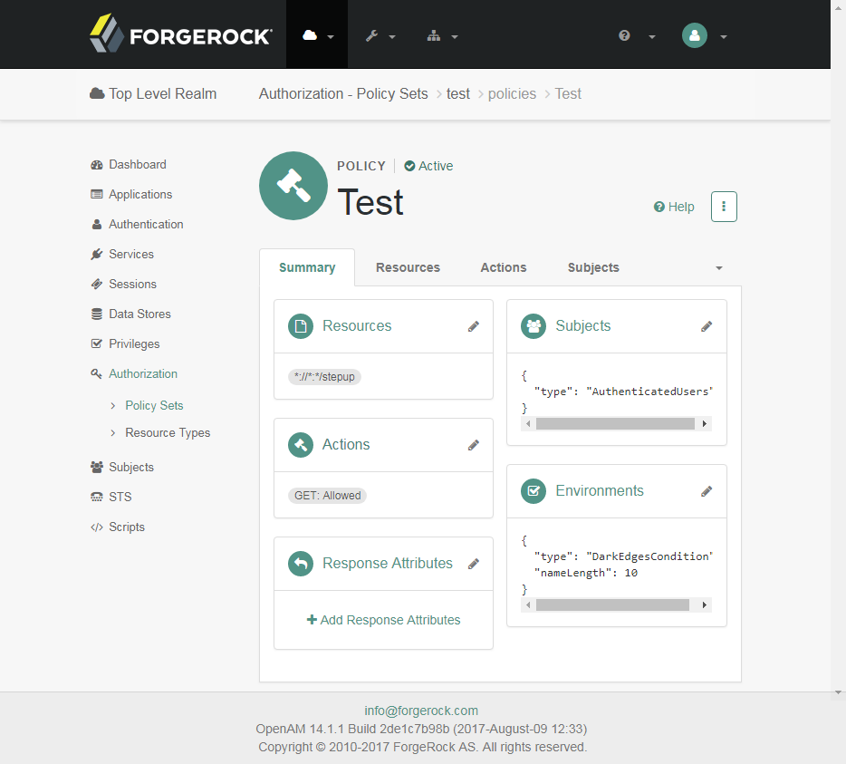

# DarkEdges Condition for ForgeRock Access Manager

Reference implementation []() updated to reflect [https://stash.forgerock.org/projects/OPENAM/repos/openam-public/browse/openam-entitlements/src/main/java/org/forgerock/openam/entitlement/conditions/environment/AuthLevelCondition.java](https://stash.forgerock.org/projects/OPENAM/repos/openam-public/browse/openam-entitlements/src/main/java/org/forgerock/openam/entitlement/conditions/environment/AuthLevelCondition.java)

## Policy



## curl

```bash
curl -X POST \
  'https://am.darkedges.com/openam/json/policies?_action=evaluate' \
  -H 'Content-Type: application/json' \
  -H 'iPlanetDirectoryPro: AQIC5wM2LY4SfcxWWPk_SbLLKm8aTaIWju7vzrTHvogImKc.*AAJTSQACMDEAAlNLABQtMTY1MDAxMDY5MDU0NDkyOTI0OAACUzEAAA..*' \
  -d '{
    "resources": [
        "https://www.darkedges.com/stepup"
    ],
    "application": "iPlanetAMWebAgentService"
 }'
```

returns

```json
[
    {
        "advices": {
            "DarkEdgesConditionAdvice": [
                "10"
            ]
        },
        "ttl": 9223372036854775807,
        "resource": "https://www.darkedges.com/stepup",
        "actions": {},
        "attributes": {}
    }
]
```